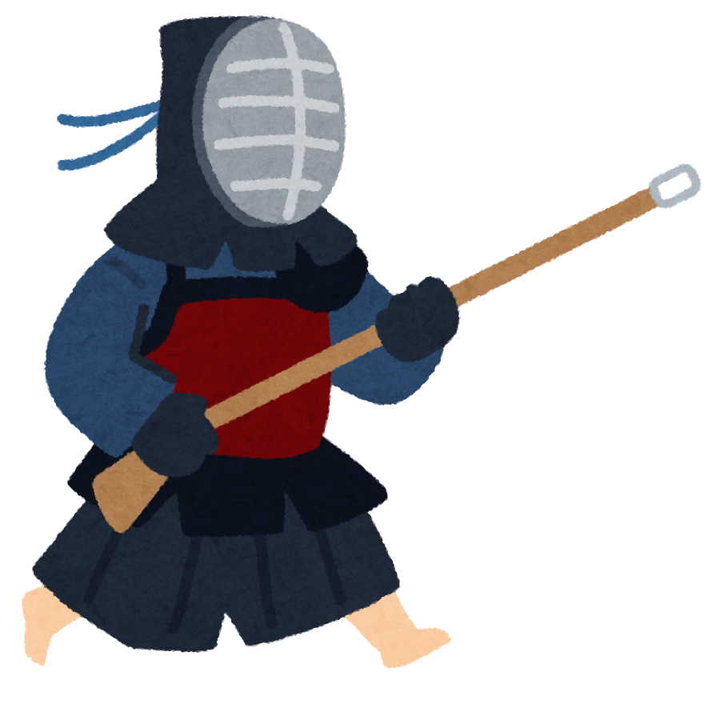
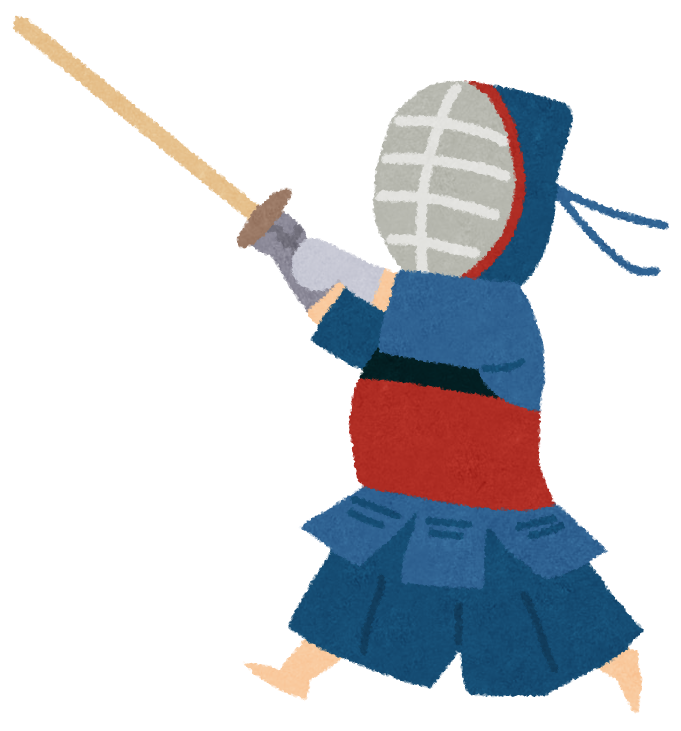

Hello, and a very warm welcome to my website! I'm a first-year PhD student in the [Interdepartmental Program in Computational Biology and Biomedical Informatics](https://cbb.yale.edu/) at Yale University.

As a data scientist in training, I have diverse academic interests across the emergent field of biomedical informatics[^1], but my primary niche is the data-driven investigation of problems in psychiatry by leveraging the power and ubiquity of wearable devices.

[^1]: Broadly construed, biomedical informatics refers to the computational analysis and statistical interpretation of biological and clinical data on high-performance computing platforms.

I was born and partially raised in Dallas, TX but spent much of my childhood in Beijing, China. I returned to Dallas to finish high school and left for Baltimore, MD for my undergraduate work, completing a B.S. in molecular and cellular biology at Johns Hopkins University (Class of 2020). I returned to Dallas once again and underwent a career transition from pre-med to biomedical informatics, taking courses and working as full-time research assistants at the University of Texas at Dallas in the [Department of Mathematical Sciences](https://math.utdallas.edu/) and UT Southwestern Medical Center in the [Quantitative Biomedical Research Center](https://qbrc.swmed.edu/). My prior research experience spans cancer biophysics, molecular radiation oncology, microfluidic single-cell analysis, statistical shape analysis, and electronic health record analysis.

Outside of research, I'm passionately interested in international relations (particularly East Asian geopolitics) and military history. My favorite publications are [*The Economist*](https://www.economist.com/), [*The New Yorker*](https://newyorker.com/), [*Reuters*](https://reuters.com/), [*The Associated Press*](https://apnews.com/), [*BBC News*](https://bbc.co.uk/news), [*The New York Times*](https://nytimes.com/), [*Bloomberg*](https://bloomberg.com/), [*The Washington Post*](https://washingtonpost.com/), [*The Atlantic*](https://theatlantic.com/), [*NPR*](https://npr.org/), and [*Nikkei Asia*](https://asia.nikkei.com). I also follow the work of the [Brookings Institution](https://www.brookings.edu/), the [Carnegie Endowment for International Peace](https://carnegieendowment.org/), and the [Center for Strategic and International Studies](https://www.csis.org/).

Ways that I add flavor to my life include reading a truly inordinate amount of news, studying languages[^2], cooking way too much Italian food[^3], and sparring with other shinai-wielding fanatics at the [Yale Kendo Club](https://yalekendo.sites.yale.edu/) (depicted below)[^3]. I'm also active in the [Yale Graduate Consulting Club](https://www.ygccgradconsulting.org/), the [Yale Biotech Club](https://www.yalebiotechclub.org/), the [Yale Japanese American Student Union](https://www.facebook.com/jasuyale/), and the [Yale Chapter of the Alexander Hamilton Society](https://www.yaleahs.com/).

[^2]: Japanese (intermediate), Mandarin Chinese (advanced), Korean (beginner), and Latin (intermediate, in theory).

[^3]: Favorite main dish is a toss-up between lasagna bolognese and carbonara; favorite dessert is tiramisù. Give me a shout if you ever want to cook together.

[^4]: With gratitude to [Irasutoya](https://irasutoya.com/). Also, we unfortunately don't practice [jūkendō](https://en.wikipedia.org/wiki/J%C5%ABkend%C5%8D); I just thought it would look cooler to have some variation here.

